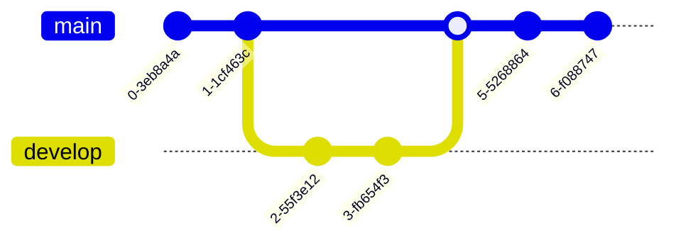

# This Blog Lives on The Edge

Full disclosure for this post. I currently (Dec 5th, 2022) work at Fastly and
get to use Compute@Edge for free as an employee benefit. There is a free trial
to test things out, but it does have restrictions on it to avoid abuse like
cryptocurrency mining and not all features like provisioned SSL certs exists.

In an effort to understand the platform I work on daily better as a *user* of
it, rather than the one implementing the platform, I decided to port my entire
blog to a different system yet again. My first iteration of this blog was a
custom webserver using the now defunct Rust web framework Iron (which dates me as
a Rustacean). I then switched to ghost for the past few years and I've been
pretty happy with it. However, I got that itch to slim it down and go back to
basics. I display static content here on the site generally so why not make my
own bespoke static site yet again like the good ole days?

Why not also run it on
[Compute@Edge](https://www.fastly.com/products/edge-compute) (C@E) so that I can
deliver said content close to where you live, have it be originless so that I
don't have to host my own server, and just completely over engineer my site for
the fun of it, while still being snappy and nice to look at? If you don't know
what I do on a regular basis, I'm Michael and I work as a Senior Software
Engineer on the Compute@Edge platform. My team works on running the wasm code
uploaded to us, not the wasm runtime itself (though we work closely with that
team). We also work on all the other parts you need in an edge compute platform
that's not just running the wasm. If you're reading this I've slung bytes to
your computer from some server close to where you live using this platform.

I spend a lot of my time implementing features or working on the Rust SDK or some
other plumbing for our internals, but I haven't really *used* the SDK. I'm able
to add features, do bug fixes, and implement new things, but using it? Well not
really. I think the cool thing about edge compute is the possibility of
originless programs. This means there's no other server to talk to for content.
Given I work at a Content Delivery Network (CDN) we sit in front of other companies websites to serve their
content faster and closer to where you are and only ask for any data from the
actual website if it's not cached or the cache is stale. We can do this as well
with C@E, but the real kicker is that it's a compute platform which means we can
run arbitrary code which could do a whole host of things. You could process a page with
dynamic content, you could easily check where the request comes from and block
it, the sky is kind of the limit. You could write a bot for instance that just
responds to webhooks and then does a bunch of things. No need for an origin
server. The model is all based around getting an http request and sending back a
response. What you do in between that is up to you subject to platform limits so
resources don't get abused.

In my case I made it to serve my blog. There's no backend server that content
gets read from, it's all in wasm. I do all the preprocessing in a Rust build
script and slap it into the code and then set the response to send back the
contents associated with a post. Let's take a look at a few of the things I do
as part of the preprocessing as this is the bulk of the code.

## Preprocessing

Given my content is static (at least for now), it makes sense to do as much
preprocessing up front. I had a few goals for the redesign:

- I wanted it to be *snappy*. At most 200ms to make the request, load the page
  and display it, but ideally a 30ms budget was my aim
- I wanted to avoid using a JS framework because they're designed for
  applications with a lot of functionality I just don't need
- If I did use JS I want it to be pretty minimal, mostly just to do things like
  send in a form or whatever
- I wanted to mostly use CSS and HTML where I could given the static nature of
  the site, but even if I make things non static in the future I wanted these to
  be the main tech powering it
- If I could do the work ahead of time to inline into the HTML I generated I
  would

With that I created a pipeline that processes everything on the site and makes
it look real nice on top of it. We can have nice sites without either bloating
them or stare at text like it was written on a terminal from the 90s. The
pipeline runs in a `build.rs` script and is the main workhorse of the site. I do
all the work upfront once, slap it into the main wasm binary, and it literally
just takes a request, checks what page to return and does so. The file for that
is actually pretty sparse and looks like this:

```rust
use fastly::http::StatusCode;
use fastly::Error;
use fastly::Request;
use fastly::Response;
use phf::phf_map;
use phf::Map;

// Macros
macro_rules! file {
    ($input:expr) => {
        include_bytes!(concat!(env!("OUT_DIR"), "/", $input))
    };
}

// Website Pages
const HOME: &[u8] = file!("home");
const ABOUT: &[u8] = file!("about");
const CONTACT: &[u8] = file!("contact");
const THE_EDGE: &[u8] = file!("the-edge");
const WEIRD: &[u8] = file!("weird-exprs");
const ORPHAN: &[u8] = file!("orphan-rules");
const RUNTIME: &[u8] = file!("rusts-runtime");
const OXIDIZING: &[u8] = file!("oxidize-interview");
const RUST_WASM: &[u8] = file!("rust-wasm");
const PAGE_404: &[u8] = file!("page-404");

// Images
const THE_EDGE_SVG_1: &[u8] = file!("the-edge-1.svg");

static LOOKUP: Map<&'static str, &'static [u8]> = phf_map! {
        "/" => HOME,
        "/about" => ABOUT,
        "/contact" => CONTACT,
        "/the-edge" => THE_EDGE,
        "/the-edge-1.svg" => THE_EDGE_SVG_1,
        "/weird-expressions-and-where-to-find-them" => WEIRD,
        "/orphan-rules" => ORPHAN,
        "/rusts-runtime" => RUNTIME,
        "/rust-wasm" => RUST_WASM,
        "/oxidizing-the-technical-interview" => OXIDIZING,
};

#[fastly::main]
fn main(req: Request) -> Result<Response, Error> {
    let path = req.get_path();
    Ok(LOOKUP
        .get(path)
        .map(|body| {
            if path.ends_with("svg") {
                make_svg_res(body)
            } else {
                make_200_res(body)
            }
        })
        .unwrap_or_else(make_404_res))
}

fn make_200_res(body: &[u8]) -> Response {
    Response::from_status(StatusCode::OK)
        .with_header("Content-Encoding", "gzip")
        // One Day - 60s/min * 60 min/hr * 24 hr/day
        .with_header("Cache-Control", "max-age=86400")
        .with_body(body)
}

fn make_404_res() -> Response {
    Response::from_status(StatusCode::NOT_FOUND)
        .with_header("Content-Encoding", "gzip")
        // One Day - 60s/min * 60 min/hr * 24 hr/day
        .with_header("Cache-Control", "max-age=86400")
        .with_body(PAGE_404)
}

fn make_svg_res(image: &[u8]) -> Response {
    Response::from_status(StatusCode::OK)
        .with_header("Content-Type", "image/svg+xml")
        // One Day - 60s/min * 60 min/hr * 24 hr/day
        .with_header("Cache-Control", "max-age=86400")
        .with_body(image)
}
```

Just 80 lines of code and most of that is just boilerplate to figure out what to
send back. The interesting part of this blog is the `build.rs` file which is
what gave the above code highlighting. It was all statically done with the
`syntect` crate so that I don't need to include `prism.js` to highlight code
examples.

The pipeline does a few steps to generate all of the pages:

- Copy all of the posts into a temporary folder
- Run the [mermaid.js](https://mermaid-js.github.io/mermaid/#/) cli tool via npx
  on each page to generate any diagrams needed
- Use the [`pulldown-cmark`](https://crates.io/crates/pulldown-cmark) crate to
  take the markdown files and generate the HTML that I need
- Use the [`maud`](https://crates.io/crates/maud) crate to then template the
  generated html into the main body that contains
  [`missing.css`](https://missing.style/) which I have predownloaded the
  minified version of to then inline into the HTML. I also include the necessary
  CSS from `syntect` here as well
- Use the [`lol_html`](https://crates.io/crates/lol_html) crate in combination
  with the [`syntect`](https://crates.io/crates/syntect) crate to rewrite the
  HTML with the actual code highlighting
- gzip the final result

Then bam it's all done, I dump it into the `OUT_DIR` where I statically read it
into the program itself!

You've already seen the code highlighting but it's not just for Rust, but Python

```python
def main() -> int:
    print("Hello World!")
    return 0

if __name__ == '__main__':
    sys.exit(main())
```

or any other language, provided I can get the sublime text highlighting
definitions into the program but for now it works for my cases! Oh and I can
also put up cool diagrams as well. Here's one for a git graph for instance:


<!-- Bit janky but only way for the css to not have text next to the image -->
<br>

I'm pretty happy with how it looks right now. I think in the future what I'll
want to do is generate all of the pages, their `const` definitions and places in
the `phf::Map` at build time as well so that I don't have to have multiple
places where I define things. It's a bit tedious and manual, but also it's not
like I will update this often so it works out well enough.

## The future?

Who knows, maybe I'll add more fancy features and CSS to add some interesting
bits to my blog posts or maybe add some more dynamic content in the future. For
now though, it's snappy looks good and has accomplished all of the goals that I
set out to do and I'm pretty happy with it all!
